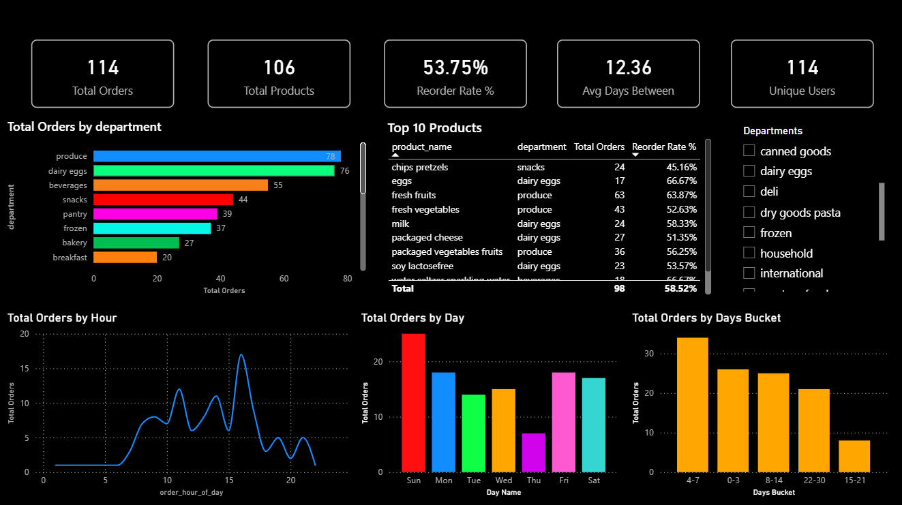

# E-Commerce Sales Analysis Dashboard

## Project Overview
This project analyzes e-commerce sales data and builds an interactive Power BI dashboard.

## Tools Used
- Excel
- Power BI
- Python (EDA)

## Key Insights
- Dariy product & Fresh Vegetables contribute 45% of total sales
- Weekend orders are 30% higher
- Top 10 products generate 38% revenue
- Treand of order in hourly basis 

## Dataset
The dataset contains sales transactions including:
- Order ID
- Product Category
- Sales Amount
- Order Date
- Department 

## Dashboard Preview

